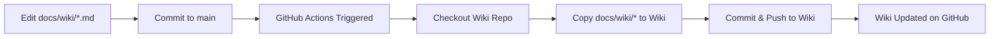

# Wiki Setup and Synchronization Guide

## 🎯 Overview

This document explains how the Karting Dashboard project maintains its wiki documentation and how the synchronization between the repository and GitHub Wiki works.

## 📋 Problem Statement

**Issue**: The GitHub Wiki appears empty, but wiki files exist in the repository.

**Root Cause**: GitHub Wiki is a separate Git repository from the main codebase. Files in `docs/wiki/` directory are not automatically visible in the GitHub Wiki UI.

**Solution**: Automated synchronization workflow that copies files from `docs/wiki/` to the GitHub Wiki repository.

## 🏗️ Architecture

### Documentation Storage

```
Repository (github.com/TheMaksoo/karting)
└── docs/wiki/              # Source of truth for wiki content
    ├── Home.md
    ├── Getting-Started.md
    └── ... (other wiki pages)

GitHub Wiki Repository (github.com/TheMaksoo/karting.wiki)
├── Home.md                 # Synced from docs/wiki/
├── Getting-Started.md      # Synced from docs/wiki/
└── ... (synced content)
```

### Sync Workflow



## 🚀 Initial Setup

### Prerequisites

1. ~~Repository must have wiki enabled in Settings~~ **No longer required!** (Auto-initialized as of Feb 2026)
2. GitHub Actions must have write permissions
3. `docs/wiki/` directory must exist with markdown files

### ~~Enable GitHub Wiki~~ (DEPRECATED - No Longer Required)

**Update (February 2026)**: The workflow now automatically initializes the wiki repository if it doesn't exist. You can skip this section!

<details>
<summary>Old manual setup instructions (kept for reference)</summary>

1. Navigate to repository Settings
2. Scroll to Features section
3. Enable "Wikis" checkbox
4. Save changes

</details>

### First-Time Sync

The wiki will be automatically created and populated when:
1. A change is pushed to `docs/wiki/**` on main branch, OR
2. The "Sync Wiki" workflow is manually triggered

**What happens automatically**:
- If wiki doesn't exist, the workflow creates and initializes it
- All content from `docs/wiki/` is synced to the wiki
- You can immediately view the wiki at `https://github.com/YOUR_ORG/YOUR_REPO/wiki`

## 🔄 How Synchronization Works

### Automatic Triggers

The wiki sync workflow (`.github/workflows/wiki-sync.yml`) runs when:

- **Push to main**: Any commit that modifies files under `docs/wiki/`
- **Manual trigger**: Via GitHub Actions UI

### Sync Process

1. **Checkout Main Repository**
   ```bash
   # Clone main repository with full history
   actions/checkout@v4
   ```

2. **Checkout Wiki Repository**
   ```bash
   # Clone wiki repository (separate Git repo)
   # URL: github.com/TheMaksoo/karting.wiki
   actions/checkout@v4 with repository: *.wiki
   ```

3. **Sync Files**
   ```bash
   # Remove existing wiki content (except .git)
   find wiki -mindepth 1 -maxdepth 1 ! -name '.git' -exec rm -rf {} +
   
   # Copy all files from docs/wiki to wiki repo
   cp -r docs/wiki/* wiki/
   ```

4. **Commit and Push**
   ```bash
   # Stage all changes
   git add .
   
   # Commit with automated message
   git commit -m "Sync wiki from docs/wiki directory [skip ci]"
   
   # Push to wiki repository (master branch)
   git push origin master
   ```

## ✏️ Editing Wiki Documentation

### Recommended: Edit in Repository

**This is the preferred method** for maintaining wiki documentation.

1. Clone the repository
   ```bash
   git clone https://github.com/TheMaksoo/karting.git
   cd karting
   ```

2. Edit files in `docs/wiki/`
   ```bash
   # Edit existing pages
   vim docs/wiki/Getting-Started.md
   
   # Or create new pages
   echo "# New Page" > docs/wiki/New-Page.md
   ```

3. Commit and push
   ```bash
   git add docs/wiki/
   git commit -m "docs: update wiki documentation"
   git push origin main
   ```

4. Wiki automatically syncs within minutes

### Not Recommended: Direct Wiki Edits

⚠️ **Caution**: Editing directly in GitHub Wiki UI is **not recommended**.

- Direct edits will be **overwritten** on next sync from repository
- No pull request review process
- Not tracked in main repository history

## 📝 File Naming Conventions

### GitHub Wiki Requirements

- **Home Page**: Must be named `Home.md`
- **Other Pages**: Use `Title-With-Hyphens.md` format
- **Internal Links**: Use `[Link Text](Page-Name)` (without .md extension in wiki)

### Example

```markdown
# In docs/wiki/Home.md

Welcome to the wiki!

See also:
- [Getting Started](Getting-Started.md)  # In repo: include .md
- [Architecture](Architecture.md)        # In repo: include .md
```

After sync to wiki, GitHub renders these as:
```markdown
- [Getting Started](Getting-Started)     # In wiki: no .md extension
- [Architecture](Architecture)           # In wiki: no .md extension
```

## 🐛 Troubleshooting

### Issue: Wiki Repository Not Found (FIXED!)

**Error Message**: `fatal: repository 'https://github.com/.../karting.wiki/' not found`

**Status**: ✅ **This issue has been fixed as of February 2026!**

The workflow now automatically creates and initializes the wiki repository if it doesn't exist. You no longer need to manually enable the wiki feature.

**If you still see this error**:
1. Ensure you're using the latest version of `.github/workflows/wiki-sync.yml`
2. Check that the workflow has `permissions: contents: write`
3. Try manually triggering the workflow again

### Issue: Wiki Still Empty After Sync

~~**Check 1: Is wiki enabled?**~~ (No longer required - auto-initialized)

**Check 1: Did workflow run successfully?**
```bash
# Navigate to: Actions → Sync Wiki
# Check for successful runs
# Look for "✅ Wiki repository initialized successfully" if first run
# Look for errors in logs
```

**Check 2: Are there changes to sync?**
```bash
# Ensure files exist in docs/wiki/
ls -la docs/wiki/
```

**Check 3: Permissions**
```yaml
# Verify .github/workflows/wiki-sync.yml has:
permissions:
  contents: write
```

### Issue: Workflow Fails with Permission Error

**Solution**: Ensure GitHub Actions has proper permissions

1. Settings → Actions → General
2. Workflow permissions → "Read and write permissions"
3. Save changes
4. Re-run workflow

### Issue: Manual Trigger Doesn't Work

**Solution**: Verify workflow_dispatch is enabled

```yaml
# In .github/workflows/wiki-sync.yml
on:
  workflow_dispatch:  # This enables manual trigger
```

### Issue: Links Break After Sync

**Problem**: Internal links use wrong format

**Solution**: 
- In repository: Use `[Text](Page-Name.md)`
- GitHub Wiki automatically converts to `[Text](Page-Name)`

### Issue: Images Don't Display

**Problem**: Relative image paths don't work in wiki

**Solution**: 
- Store images in wiki: `docs/wiki/images/screenshot.png`
- Reference: ``
- Or use absolute URLs to repository

## 🔧 Maintenance

### Adding New Wiki Pages

1. Create new `.md` file in `docs/wiki/`
2. Use descriptive filename with hyphens
3. Add link in `Home.md` or related pages
4. Commit and push
5. Sync happens automatically

### Updating Existing Pages

1. Edit the markdown file in `docs/wiki/`
2. Commit with descriptive message
3. Push to main branch
4. Sync happens automatically

### Removing Wiki Pages

1. Delete file from `docs/wiki/`
2. Remove links from other pages
3. Commit and push
4. File removed from wiki on next sync

### Manual Sync Trigger

Sometimes you need to force a sync:

1. Go to [Actions tab](https://github.com/TheMaksoo/karting/actions)
2. Select "Sync Wiki" workflow
3. Click "Run workflow" dropdown
4. Select branch (usually `main`)
5. Click "Run workflow" button

## 📊 Monitoring

### Check Sync Status

```bash
# View recent workflow runs
https://github.com/TheMaksoo/karting/actions/workflows/wiki-sync.yml

# Check wiki repository directly
git clone https://github.com/TheMaksoo/karting.wiki.git
cd karting.wiki
git log --oneline -10
```

### Verify Wiki Content

```bash
# Compare repository vs wiki
diff -r docs/wiki/ /path/to/karting.wiki/

# Or browse wiki online
https://github.com/TheMaksoo/karting/wiki
```

## 🎯 Best Practices

### DO:
✅ Edit wiki files in `docs/wiki/` directory  
✅ Review wiki changes via pull requests  
✅ Use relative links between wiki pages  
✅ Keep one topic per page  
✅ Update links when renaming pages  

### DON'T:
❌ Edit wiki directly through GitHub Wiki UI  
❌ Store large binary files in wiki  
❌ Use absolute paths to wiki pages  
❌ Forget to update Home.md when adding pages  

## 🔗 Related Resources

- [GitHub Wiki Documentation](https://docs.github.com/en/communities/documenting-your-project-with-wikis)
- [GitHub Actions Documentation](https://docs.github.com/en/actions)
- [Markdown Guide](https://www.markdownguide.org/)

## 📖 Additional Documentation

- [docs/wiki/README.md](../wiki/README.md) - Quick reference guide
- [CONTRIBUTING.md](../../CONTRIBUTING.md) - How to contribute
- [README.md](../../README.md) - Project overview

---

## 🤝 Need Help?

If you encounter issues with wiki synchronization:

1. Check workflow logs: [Actions tab](https://github.com/TheMaksoo/karting/actions)
2. Review this guide's troubleshooting section
3. Open an issue: [GitHub Issues](https://github.com/TheMaksoo/karting/issues)

---

*Last Updated: February 2026*
